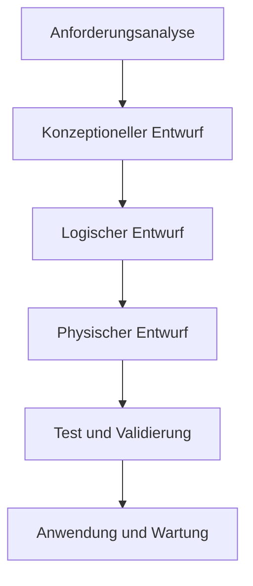

# Lebenszyklus einer Datenbank

Bei der Entwicklung und dem Einsatz von Software werden die verschiedenen Phasen wie z.B. Analyse, Planung, Entwicklung, Testen und Anwendung von Software unterschieden und unter dem Begriff des Software-Lebenszyklus zusammengefasst. Diese Einteilung in Entwicklungsphasen kann auch auf dem Gebiet der Datenbanken angewendet werden.

In der **Anforderungsanalyse** werden die Anforderungen aller Benutzer an die neue Datenbank zusammengetragen. Diese Anforderungen werden meist nach bestimmten Kriterien klassifiziert, z. B. nach Abteilungen bzw. Benutzergruppen. Wichtig ist, dass festgelegt wird, welche Daten gespeichert werden sollen (was zu speichern ist) und wie die Daten zu bearbeiten sind.

Der **konzeptionelle Entwurf** umfasst die Modellierung der Sichten und die Integration in ein Gesamtschema. Dafür werden meist Entity-Relationship-Diagramme erstellt.

In dem **logischen Entwurf** erfolgt die Umsetzung des konzeptionellen Schemas in das Datenmodell des Datenbanksystems (z.B. in das relationale Datenmodell). Dafür stehen meist entsprechende Transformationsregeln zur Verfügung. Anschließend wird das Datenbankschema normalisiert, wodurch z. B. Redundanzen beseitigt werden.

Nun kann die Datenbank mithilfe der Sprachmittel des DBMS erstellt und die benötigten Anfragen können formuliert werden, was als **physischer Entwurf** bzw. Implementierung bezeichnet wird. Für relationale DBS geschieht dies in der Abfragesprache SQL. 

Die Datenbank und die erstellten Abfragen werden nun **getestet**, und die Ergebnisse werden auf ihre Gültigkeit bezüglich der Anforderungen geprüft (**validiert**). So wird die Sicherung der Datenbank-Qualität gewährleistet.

In der Phase der **Anwendung** muss die Datenbank ständig **gewartet** werden. Im Laufe dieser Zeit können sich Änderungen des Datenbankschemas ergeben. In diesem Fall ist eine Reorganisation der Datenbank notwendig.
